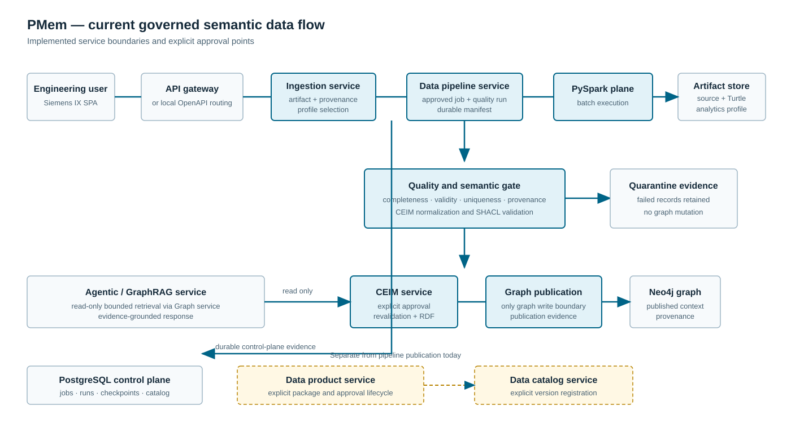
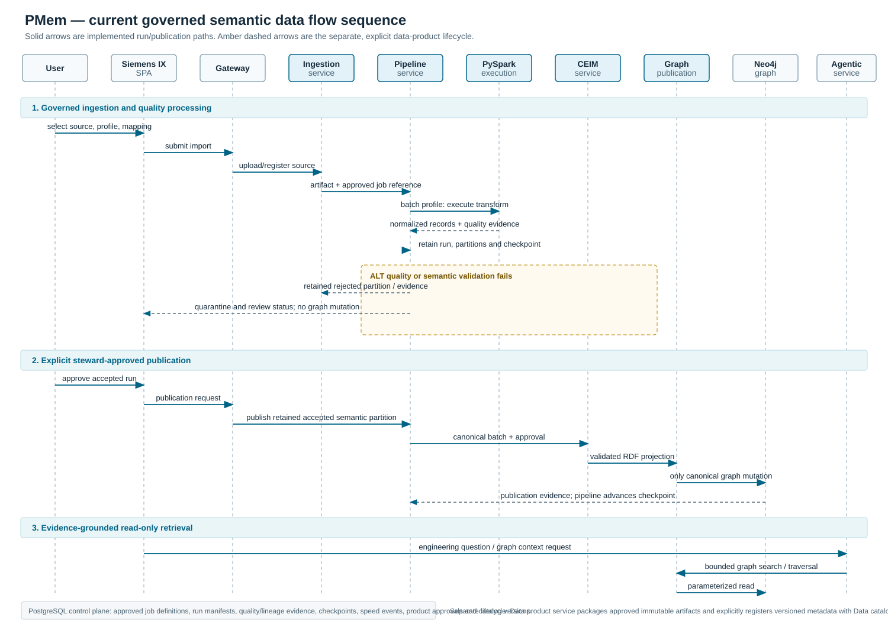

# Current Architecture — Governed Semantic Data Flow

This diagram represents the current PMem microservice flow. In customer
deployments, the API gateway is the entry point; local development may route
the Siemens IX frontend directly to the individual OpenAPI services.



## Sequence diagram



The portable images above are the display versions. The Mermaid source below
is kept as an editable technical representation.

```mermaid
sequenceDiagram
    autonumber
    actor User as Engineering user
    participant UI as Siemens IX SPA
    participant GW as API gateway
    participant ING as Ingestion service
    participant PIPE as Data pipeline service
    participant SPARK as PySpark execution plane
    participant ART as Immutable artifact store
    participant CEIM as Canonical CEIM service
    participant GRAPH as Graph publication service
    participant PROD as Data product service
    participant CAT as Data catalog service
    participant PG as PostgreSQL control plane
    participant N4J as Neo4j semantic graph
    participant AGENT as Agentic / GraphRAG service

    User->>UI: Select source, profile and ontology mapping
    UI->>GW: Submit governed import request
    GW->>ING: Upload or register source artifact
    ING->>ART: Store immutable artifact and manifest<br/>checksum, provenance, source revision
    ING->>PIPE: Start approved job definition and profile
    PIPE->>PG: Load approved job definition<br/>persist running run manifest and checkpoint

    alt batch / high-volume profile
        PIPE->>SPARK: Parse and transform immutable input
        SPARK->>ART: Read retained immutable input
        SPARK-->>PIPE: Normalized records and quality evidence
    else bounded / interactive profile
        PIPE->>ART: Read retained immutable input
        PIPE-->>PIPE: Normalize, map and validate records
    end
    PIPE->>PG: Persist completed run, quality result<br/>and immutable artifact references

    alt quality or semantic validation failure
        PIPE->>ART: Retain rejected partition and quality evidence
        PIPE->>PG: Persist quarantine/review status
        PIPE-->>UI: Quarantine/review status; no graph mutation
    else approved publication is requested by a steward
        UI->>GW: Approve publication of accepted run
        GW->>PIPE: Publish retained accepted semantic partition
        PIPE->>CEIM: Submit canonical semantic batch and approval
        CEIM->>CEIM: Re-normalize and enforce SHACL/identity checks
        CEIM->>GRAPH: Submit deterministic Turtle projection
        GRAPH->>N4J: Canonical graph mutation only
        N4J-->>GRAPH: Publication receipt
        GRAPH-->>CEIM: Publication evidence
        CEIM-->>PIPE: Approved publication evidence
        PIPE->>PG: Advance checkpoint after publication success
    end

    PIPE-->>UI: Run status, quality metrics, lineage and replay details
    UI->>GW: Request graph context or engineering question
    GW->>AGENT: Evidence-grounded retrieval request
    AGENT->>GRAPH: Read-only bounded graph search/traversal
    GRAPH->>N4J: Parameterized read query
    N4J-->>GRAPH: Nodes, relationships and provenance
    GRAPH-->>AGENT: Bounded evidence context
    AGENT-->>UI: Explainable response with source evidence

    opt independently approved data-product lifecycle
        UI->>GW: Publish a versioned data product
        GW->>PROD: Package approved immutable artifacts and semantic releases
        PROD->>PG: Persist product manifest and approval record
        PROD->>CAT: Register or retry catalog registration
        CAT->>PG: Persist catalog version and latest pointer
    end

    opt low-latency speed path
        GW->>PIPE: Register approved source or submit event envelope
        PIPE->>PG: Persist idempotent event and reconciliation state
        PIPE->>CEIM: Validate reconciled event partition before publication
    end

    Note over AGENT,GRAPH: Agents have no direct graph write access.<br/>Any proposed mutation must re-enter the governed CEIM → graph-publication path.
```

## Operational visibility

`Data pipeline service` exposes OpenAPI telemetry, versioned job definitions,
durable run manifests, the explicit `data-quality-assessment` job, replay and
speed-path reconciliation under `/api/v1/pipeline/*`. The Data Flow UI is the
operational dashboard. Zeppelin is an optional analysis surface and must not
bypass the canonical publication boundary.

PostgreSQL is the control plane, not the graph store: it persists data-job
definitions, durable run manifests, checkpoints, speed-path events and
reconciliations, data-product approvals, catalog versions, and retention
evidence. Immutable source/derived bytes remain in the artifact store; Neo4j
contains only the approved semantic graph projection.

The data catalog and data-product services are implemented as independent,
explicit APIs. They are **not automatically invoked** by the current pipeline
publication endpoint; the optional block above accurately reflects that
separate lifecycle. Wiring an approved run to automatic product packaging is a
future orchestration capability, not a present claim.

Schema conversion is now the bridge into that independent lifecycle: it retains
the XSD source, serialized Turtle and schema analytics profile, and returns a
data-product draft that requires semantic-release and steward approval.
