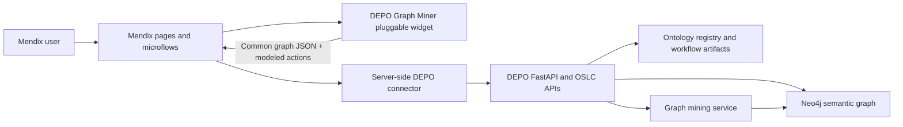

# DEPO Mendix and Graph Miner Requirements Plan

Status: Baselined for implementation  
Target: Mendix 11.12 React client, with Mendix 10.18+ compatibility evaluated during qualification  
Owners: Product, DEPO platform, Mendix delivery, security, graph engineering, QA

Related integration specification: `docs/mendix-teamcenter-embedded-integration.md`

## 1. Purpose

Transition the DEPO user experience into governed Mendix pages while retaining the FastAPI/Neo4j semantic platform and delivering reusable React Flow/D3 graph widgets. The transition must preserve ontology, instance-linking, metadata, OSLC, inference, reporting, and unstructured-document behavior without moving privileged graph credentials into the browser.

## 2. Graph Miner Assumption

`Graph Miner` is defined here as a DEPO capability, not as an assumed third-party product. It covers neighborhood discovery, shortest paths, connected components, degree-based hubs, isolates, relationship-frequency patterns, and future server-side community/similarity algorithms. If a named commercial Graph Miner is selected later, it must implement the contracts in this document and pass the same acceptance gates.

The existing Mendix Marketplace Network Graph widget may be evaluated as a buy-versus-build comparator, but it is not an architectural dependency.

## 3. Target Architecture



The widget is presentation and interaction only. Authentication, authorization, API secrets, graph queries, destructive operations, and audit persistence remain server-side.

## 4. Functional Requirements

| ID | Requirement | Priority | Acceptance |
|---|---|---:|---|
| MX-FR-001 | Provide an installable Mendix pluggable web widget with React Flow and D3 renderer selection. | Must | Mendix release tooling creates an `.mpk`. |
| MX-FR-002 | Accept the DEPO common graph contract: nodes with `id/label/type` and links with `source/target/type`. | Must | Invalid and dangling records are rejected without crashing. |
| MX-FR-003 | Expose node selection to a modeled Mendix action with node ID, label, and type variables. | Must | Microflow/nanoflow receives selected values. |
| MX-FR-004 | Support read-only exploration, zoom, pan, selection, labels, and bounded force layout. | Must | Both renderers pass interaction smoke tests. |
| MX-FR-005 | Support editable modeling with position/relationship change notification. | Should | A modeled action is called after a graph change. |
| MX-FR-006 | Preserve DEPO page routes and customer-facing names during transition. | Must | Navigation smoke covers all application pages. |
| MX-FR-007 | Provide ontology display normalization independent of the legacy Ontology Junction component. | Must | Temporary Owlready identifiers never appear as customer labels. |
| MX-FR-008 | Provide import intent/status rules independent of the legacy Import component. | Must | File routing and resumable-job rules pass unit tests. |
| GM-FR-001 | Mine a bounded neighborhood around a selected node. | Must | Depth 0–10 returns only induced nodes/links. |
| GM-FR-002 | Calculate shortest paths with explicit directed/undirected semantics. | Must | Connected and disconnected cases are deterministic. |
| GM-FR-003 | Calculate connected components, isolates, degree centrality, and hubs. | Must | Results are stable across input order. |
| GM-FR-004 | Report relationship-type frequencies and graph summary metrics. | Must | Counts match normalized graph data. |
| GM-FR-005 | Add server-side community, similarity, and pattern mining for large graphs. | Should | Async API produces retained, auditable result artifacts. |
| GM-FR-006 | Allow a mined result to become a saved Mendix investigation/view without mutating the source graph. | Should | Saved view contains query, scope, user, time, and source revision. |

## 5. Non-Functional Requirements

| ID | Requirement | Acceptance threshold |
|---|---|---|
| MX-NFR-001 | Security | No API keys, Neo4j credentials, or privileged endpoints in widget properties or bundles. |
| MX-NFR-002 | Authorization | Mendix microflows and DEPO APIs enforce user/tenant scope; UI hiding is not authorization. |
| MX-NFR-003 | Performance | Default 1,000 nodes; hard client ceiling 5,000 nodes and 10 links per accepted node. Larger mining runs server-side. |
| MX-NFR-004 | Accessibility | Labeled graph region, keyboard-selectable D3 nodes, visible selection, configurable tab index, non-color labels. |
| MX-NFR-005 | Lifecycle | All simulations, timers, observers, and requests stop on unmount. |
| MX-NFR-006 | Compatibility | React client compatible; no Dojo/dijit or `mx.ui.openForm`. |
| MX-NFR-007 | Supply chain | Lockfile, SBOM/license report, vulnerability scan, and no GPL/LGPL/MPL dependency in a public Marketplace package. |
| MX-NFR-008 | Observability | Correlation ID, action name, elapsed time, result size, and failure category recorded server-side. |
| MX-NFR-009 | Reliability | Graph-mining jobs are idempotent by normalized request hash and recoverable across worker restart. |
| MX-NFR-010 | Data protection | Tooltips/actions expose only properties approved by the Mendix domain model and DEPO policy. |

## 6. Data and Action Contract

Node JSON:

```json
{"id":"REQ-42","label":"Cooling requirement","type":"Requirement","properties":{},"metadata":{},"x":120,"y":80}
```

Relationship JSON:

```json
{"id":"trace-1","source":"REQ-42","target":"SYS-7","type":"SATISFIED_BY","properties":{},"metadata":{}}
```

Widget actions:

- `onNodeSelect(nodeId, nodeLabel, nodeType)`
- `onGraphChange()` for a modeled refresh/save workflow
- Future: `onExpand(nodeId, depth)` and `onSaveView(graphJson, miningRequestJson)`

## 7. Mendix Domain Model Requirements

- `GraphView`: ID, name, renderer, query JSON, source revision, owner, created/updated timestamps.
- `GraphNode`: external ID, label, type, display JSON, risk/status fields.
- `GraphLink`: external ID, source ID, target ID, type, display JSON.
- `MiningJob`: request hash, algorithm, parameters, status, progress, result artifact, error category.
- `InvestigationAudit`: user, action, node ID, graph view, timestamp, correlation ID.
- Credentials and backend base URLs must use server-side constants/secrets, never persisted in these entities.

## 8. Transition Plan

1. Install the private `.mpk` into a Mendix 11.12 sandbox app.
2. Build a server-side connector/microflow for health, graph view, contextual subgraph, taxonomy, reasoning, reports, and durable jobs.
3. Recreate shell/navigation and read-only pages using Atlas UI and Mendix-native controls.
4. Use the DEPO widget for Graph Explorer and Model Workbench; keep destructive/admin flows as modeled pages with confirmation microflows.
5. Transition Ontology Junction and Import using the extracted presentation/domain rules rather than embedding the legacy 3,000-line React pages.
6. Add Graph Miner server APIs for algorithms above the browser ceiling and persist result artifacts.
7. Run parity, security, accessibility, performance, rollback, and customer-dataset acceptance gates.
8. Retire each React page only after its Mendix replacement passes parallel-run reconciliation.

## 9. Cutover and Rollback

- Use feature flags per page and per tenant.
- Run React and Mendix views against the same read-only APIs during reconciliation.
- Do not dual-write graph mutations. Route writes through one governed DEPO API.
- Record the previous UI route and widget version with every rollout.
- Rollback means disabling the Mendix feature flag and restoring the previous route; data contracts remain unchanged.

## 10. Definition of Done

- `.mpk` builds using current Mendix tooling and installs in the target Studio Pro version.
- All frontend/backend/API contract tests pass.
- Page navigation and representative customer graph smoke tests pass in Chromium and Firefox.
- Security scan, license inventory, and accessibility review have no release blockers.
- Graph Miner results are deterministic, scoped, size-bounded, and auditable.
- Product owner signs functional parity; security signs the connector/auth model; operations signs monitoring and rollback.

## 11. Authoritative References

- Mendix Pluggable Widgets API: <https://docs.mendix.com/apidocs-mxsdk/apidocs/pluggable-widgets-10/>
- Mendix property types: <https://docs.mendix.com/apidocs-mxsdk/apidocs/pluggable-widgets-property-types/>
- Mendix React client requirements: <https://docs.mendix.com/refguide10/mendix-client/react/>
- Mendix Marketplace governance: <https://docs.mendix.com/appstore/submit-content/governance-process/>
- React Flow custom nodes: <https://reactflow.dev/learn/customization/custom-nodes>
