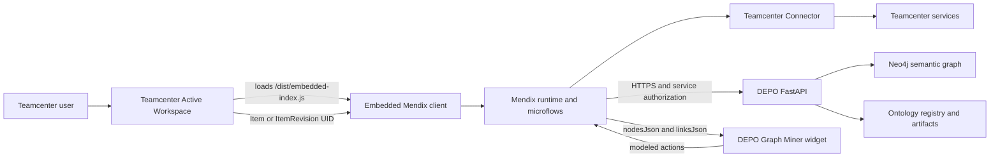

# Mendix Inside Teamcenter and DEPO Neo4j Integration

Status: Architecture baseline  
Updated: 2026-07-14  
Target: Mendix 11.12 embedded client, Teamcenter Active Workspace, Teamcenter Connector, DEPO FastAPI, and Neo4j

## 1. Purpose

Embed the Mendix DEPO experience inside Teamcenter Active Workspace and use the selected Teamcenter object as context for ontology, traceability, graph exploration, and Graph Miner workflows. Teamcenter remains the authoritative PLM source; Neo4j remains a governed semantic projection rather than a replacement system of record.

## 2. Version and Release Gate

As of 2026-07-14, Mendix Inside Teamcenter is a public-beta capability.

| Component | Embedded beta requirement | Production implication |
|---|---|---|
| Mendix Studio Pro | 11.12.0 or above | 11.12 provides the Embedded navigation profile and embedded client bundle. |
| Teamcenter | 2512 | Active Workspace must be customizable and redeployable. |
| Teamcenter Connector | 2606.0.0 or above | The required version is documented but not yet published; obtain early access before embedded validation. |
| Planned GA baseline | Mendix 11.18 / Teamcenter 2612 | Requalify against the published GA matrix before production rollout. |

A standalone Mendix 11.12 application can use a currently published compatible Teamcenter Connector. Running that app as a native micro-frontend inside Active Workspace remains beta-gated.

## 3. Target Architecture



The `.mpk` is installed in the Mendix application. It is not embedded independently in Teamcenter. Active Workspace embeds the Mendix application, which then renders the widget on a modeled page.

## 4. Ownership Boundaries

| Concern | Owning component |
|---|---|
| Product structure, revisions, datasets, and lifecycle state | Teamcenter |
| Teamcenter login, session, and service operations | Teamcenter Connector |
| Page state, role checks, orchestration, and user interactions | Mendix runtime and microflows |
| Ontologies, semantic projections, inference, cross-domain links, and graph queries | DEPO FastAPI and Neo4j |
| Graph presentation, pan/zoom, selection, and bounded client mining | DEPO Graph Miner widget |
| Write-back to Teamcenter | Teamcenter Connector only |
| Neo4j mutations | Governed DEPO APIs only |

Neither the browser nor the pluggable widget may contain Teamcenter service credentials, Neo4j credentials, unrestricted Cypher, or privileged DEPO secrets.

## 5. Embedded Startup Contract

Active Workspace passes stable Teamcenter identifiers through the embedded client's `render()` parameters.

```json
{
  "parameters": {
    "ItemUid": "AaBcd12345"
  }
}
```

Use persistable `Item` or `ItemRevision` UIDs. Prefer `Item` UIDs where revision-independent context is required. Do not use BOM-line UIDs as durable identifiers because they can change when Teamcenter configuration rules change.

The Mendix Embedded profile must define:

- A default home page that accepts the supported startup parameters.
- A fallback page for absent, invalid, inaccessible, or incorrectly typed parameters.
- Page and microflow access for every allowed application role.

## 6. Mendix Modules and Domain Model

Required modules:

- `TcConnector`, imported from the Mendix Marketplace.
- `DEPOConnector`, owned by this application and responsible for authenticated DEPO REST calls.
- `DEPO_Teamcenter`, owned by this application and responsible for mappings and orchestration.
- The `depo.graphminer.DepoGraphMiner` widget package.

Do not modify the Teamcenter Connector domain model. Extend it from `DEPO_Teamcenter` so connector upgrades remain supportable.

Suggested non-persistent entities:

| Entity | Important attributes |
|---|---|
| `EmbeddedContext` | `ItemUid`, `ItemRevisionUid`, `Source`, `CorrelationId`, `ErrorMessage` |
| `TeamcenterItemContext` | `ItemId`, `RevisionId`, `ObjectType`, `Name`, `LifecycleState` |
| `GraphResponse` | `NodesJson`, `LinksJson`, `TotalNodes`, `TotalLinks`, `CorrelationId`, `ErrorMessage` |
| `SelectedGraphNode` | `NodeId`, `NodeLabel`, `NodeType`, `SourceUid` |

## 7. Microflow Design

### Embedded startup

```text
ACT_OpenEmbeddedGraph(ItemUid)
  -> validate parameter shape and page access
  -> resolve the active Teamcenter configuration/session
  -> SUB_TC_LoadItemContext(ItemUid)
  -> SUB_DEPO_LoadContextGraph(ItemUid, mapped Teamcenter context)
  -> create GraphResponse
  -> show EmbeddedGraph page
```

### Teamcenter retrieval

```text
SUB_TC_LoadItemContext(ItemUid)
  -> Teamcenter Connector GetProperties
  -> optionally GetStructure and GetDatasets
  -> handle ServiceException through TcConnector.HandleServiceErrors
  -> map connector entities into DEPO_Teamcenter entities
```

### DEPO graph retrieval

```text
SUB_DEPO_LoadContextGraph(ItemUid, TeamcenterItemContext)
  -> obtain server-side API authorization
  -> call a governed DEPO contextual-subgraph or Teamcenter-context endpoint
  -> validate response and enforce client graph limits
  -> assign NodesJson and LinksJson on GraphResponse
```

### Widget interaction

```text
ACT_GraphNodeSelected(NodeId, NodeLabel, NodeType)
  -> authorize the requested detail action
  -> resolve the source Teamcenter UID or DEPO resource
  -> open details, refresh context, or execute an approved operation
```

Write-back must be explicit, confirmed, authorized, audited, and sent through the Teamcenter Connector. A Neo4j relationship must never be treated as proof that the corresponding Teamcenter mutation succeeded.

## 8. Authentication and Browser Controls

Embedded operation requires:

1. Register the Mendix application with the identity provider used by Teamcenter Security Services.
2. Configure Teamcenter Connector with Teamcenter SSO.
3. Provision or match Mendix accounts to Teamcenter users; anonymous Mendix access is forbidden.
4. Use HTTPS for the Teamcenter and Mendix origins.
5. Set `com.mendix.core.SameSiteCookies` to `None` for the embedded deployment.
6. Allow credentialed CORS only from the exact Teamcenter Active Workspace origin.
7. Add the Mendix origin to the required Active Workspace CSP directives, including script, connect, style, font, and image sources.
8. Ensure organizational browser policy permits cross-site cookies for the approved domains.
9. Keep DEPO API secrets in server-only Mendix constants or an approved secret store; do not expose them to the client.

Do not combine `Access-Control-Allow-Credentials: true` with a wildcard origin.

## 9. Network Requirements

| Source | Destination | Purpose |
|---|---|---|
| User browser | Teamcenter Active Workspace | Host application and Teamcenter interaction |
| User browser | Mendix runtime | Load the embedded bundle and use the Mendix session |
| Mendix runtime | Teamcenter services | Teamcenter Connector operations |
| Mendix runtime | DEPO FastAPI | Semantic and graph operations |
| DEPO FastAPI | Neo4j | Pooled Bolt/TLS graph queries and governed mutations |

Neo4j does not need to be reachable from Active Workspace, the browser, or the Graph Miner widget.

## 10. Acceptance Gates

- Embedded profile exposes `/dist/embedded-index.js` and mounts inside Active Workspace.
- Teamcenter SSO completes and produces a non-anonymous Mendix user with correct roles.
- Valid `Item` and `ItemRevision` UIDs open the expected contextual graph.
- Missing, malformed, or unauthorized UIDs reach the controlled fallback path without data disclosure.
- Teamcenter service failures use connector error handling and produce a correlation ID.
- DEPO/Neo4j unavailability produces a recoverable page state without breaking the Teamcenter session.
- Graph Miner receives bounded node/link JSON and node selection returns modeled action variables.
- No Teamcenter, DEPO, or Neo4j secret is present in browser storage, startup parameters, widget properties, or bundles.
- CORS and CSP permit only the approved origins and resources.
- Write-back tests prove Teamcenter confirmation, audit, retry, and failure behavior.
- Customer-like performance tests cover structure expansion, 1,000-node rendering, refresh, and concurrent sessions.
- Production approval is repeated against the published GA compatibility matrix.

## 11. Rollback

Keep the responsive Mendix profile independently deployable. If embedded-client, SSO, CSP, or connector behavior fails, remove or disable the Active Workspace component and direct authorized users to the standalone Mendix URL. This rollback does not require changing Neo4j or the DEPO API.

## 12. Authoritative References

- [Embedding the Mendix Client](https://docs.mendix.com/refguide/mendix-client/embedding-the-client/)
- [Mendix Inside Teamcenter](https://docs.mendix.com/refguide/mendix-client/mendix-inside-teamcenter/)
- [Teamcenter Connector](https://docs.mendix.com/appstore/modules/siemens-plm/teamcenter-connector/)
- [Teamcenter Connector compatibility matrix](https://docs.mendix.com/appstore/modules/siemens-plm/compatibility-matrix/)
- [Configuring Teamcenter Connector 2512 and above](https://docs.mendix.com/appstore/modules/siemens-plm/configuring-connection-2512/)
- [Teamcenter Connector domain model](https://docs.mendix.com/appstore/modules/siemens-plm/teamcenter-domain-model/)
- [Using included Teamcenter services](https://docs.mendix.com/appstore/modules/siemens-plm/using-included-services/)

